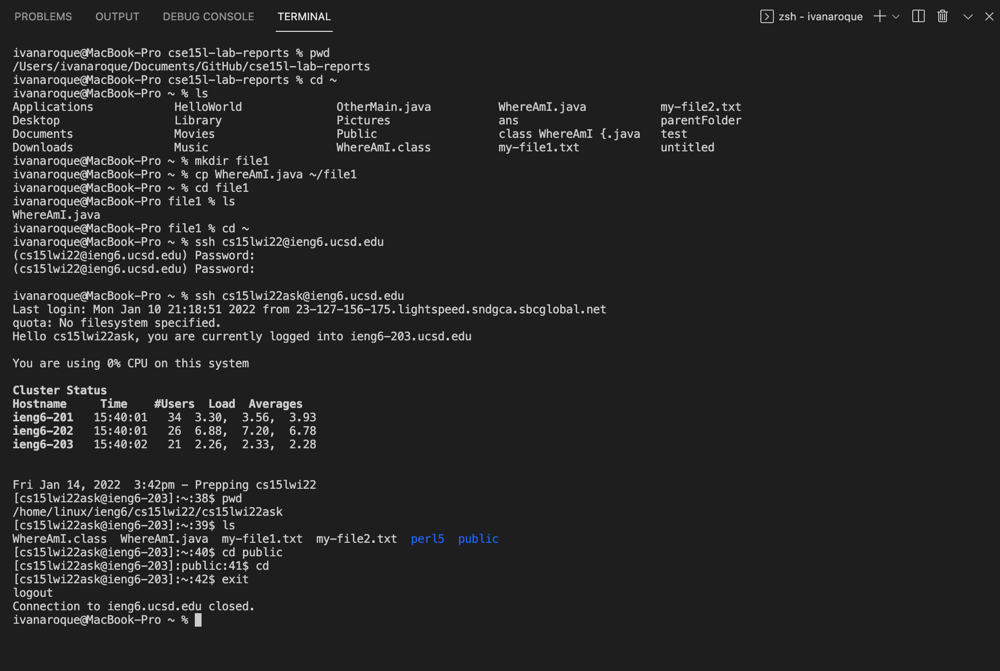
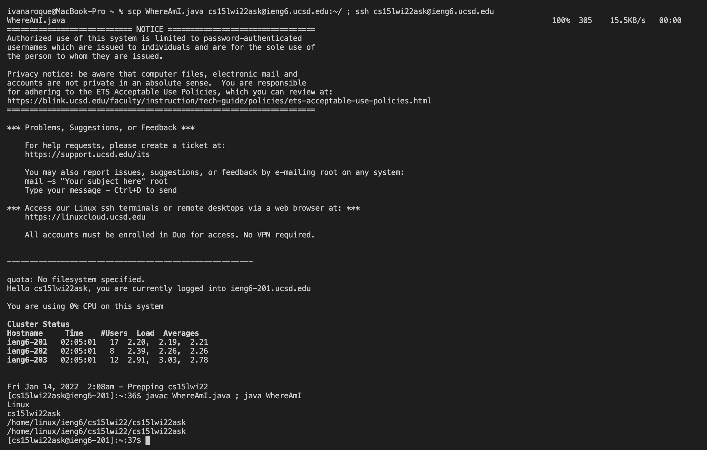

# Lab Report 1

## Installing VSCode

Go to VS Code website ([VSCode Link](https://code.visualstudio.com/)) and follow the instructions in order to download and install VSCode.

Since the computer that I use is a MacBook, I would download the version that is for MacOS.

After downloading and installing is complete, you should be able to open VSCode.

## Remotely Connecting

Open a terminal in VSCode (This can be done by Terminal -> New Terminal options).

Use the command `ssh cs15lxx@ieng6.ucsd.edu` to remotely connect to this server.

`xx` should be replaced with your unique letters after looking up your course-specific account for CSE 15L here: [Account Lookup](https://sdacs.ucsd.edu/~icc/index.php)

## Trying Some Commands

Type commands such as `pwd` , `ls`, `cd`, `cp` , `mkdir`, and so forth.

`pwd` command will print out your working directory.

`ls` lists out all the files and directories in your current directory.

`mkdir` creates a new directory in your current directory.

`exit` enables us to logout of the remote server.

## Moving Files with "scp"

type up the command `scp <Filename> cs15lwi22zz@ieng6.ucsd.edu:~/` . This will copy a file into the home directory of the remote server. 
  
You will be prompted to type your password after this command.

Once done, the file should be copied on the remote server. 

Note: The scp command will automatically overwrite an existing file in the server when copying a file with the same name so be careful.
 
  
## Setting an SSH key

  
You will run the command ssh-keygen. 
  
This will create two new files on your system; the private key (in a file `id_rsa`) and the public key (in a file `id_rsa.pub`) stored in `.ssh` directory in your computer.  
  
You will need to copy the public key to the .ssh directory of your user account on the server.

After this is done, you will no longer be required to enter your password when running `ssh` or `scp` from client to the remote server.
  
  
## Optimizing Remote Running

  
You can optimize your process of copying and moving a file to the remote server by running multiple commands in one line and using up arrow keys to recall previous commands.
  
Run the command `scp <Filename> <Some directory in the remote server> ; ssh cs15lwi22zz@ieng6.ucsd.edu`.
  
Then run `javac <Filename>; java <Filename>`.

When running efficiently, you can expect to complete the process in about 17 total keystrokes or less.  

This is significantly less keystrokes than typing up every commands and running single commands to complete the proccess which can take up well over 100 keystrokes.

Overall, you have reduced the amount single commands you run and keystrokes needed to complete the process thus, speeding up the process.  
