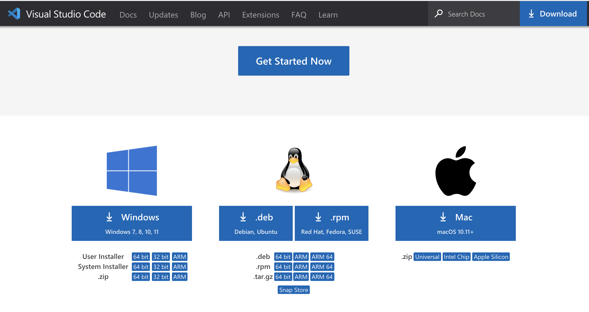
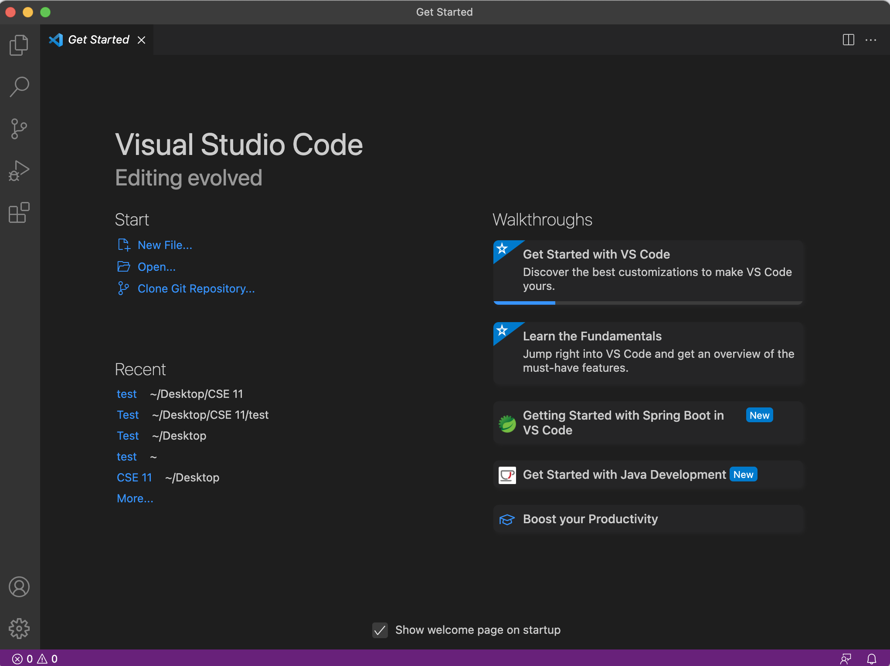
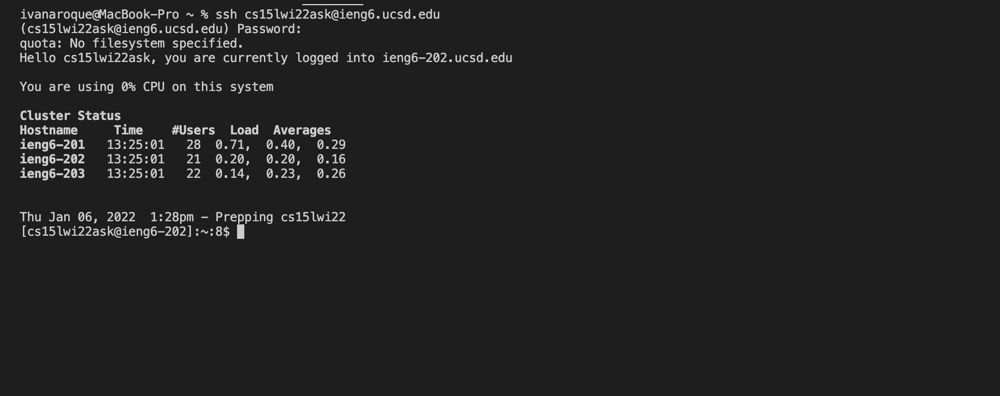
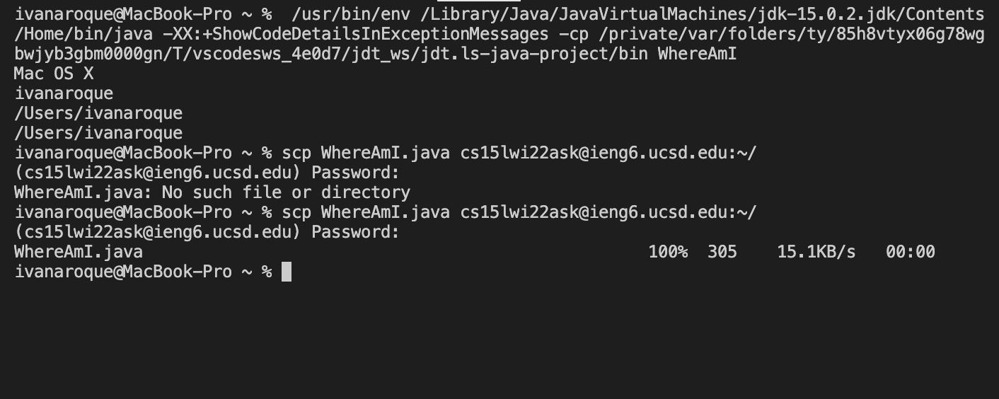
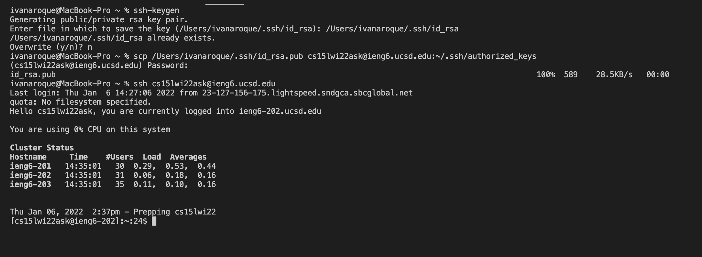

# Lab Report 1

## Installing VSCode

Go to VS Code website ([Link](https://code.visualstudio.com/)) and follow the instructions in order to download and install VSCode.

Since the computer that I use is a MacBook, I would download the version that is for MacOS.

## Remotely Connecting

Open a terminal in VSCode

Use the command "ssh cs15lxx@ieng6.ucsd.edu" to remotely connect to this server

"xx" is your unique characters to your account.

## Trying Some Commands

Type commands such as "pwd" , "ls", "cd", "cp" , and so forth.

"pwd" command will print out your working directory.

"ls" lists out all the files and directories in your current directory.

## Moving Files with "scp"

type up the command scp <Filename> cs15lwi22zz@ieng6.ucsd.edu:~/. This will copy a file into the home directory of the remote server. 
  
You will be prompted to type your password after this command.  
 
  
## Setting an SSH key

  
You will run the command ssh-keygen 
  
This will create two new files on your system; the private key and the public key.  
  
We will need to copy the public key to the .ssh directory of our user account on the server.
  
  
## Optimizing Remote Running
  
You can optimize your process by running multiple commands in one line.
  
Run the command scp <Filename> <Some directory in the remote server> ; ssh cs15lwi22zz@ieng6.ucsd.edu
  
Then run javac <Filename>; java <Filename>  
  
