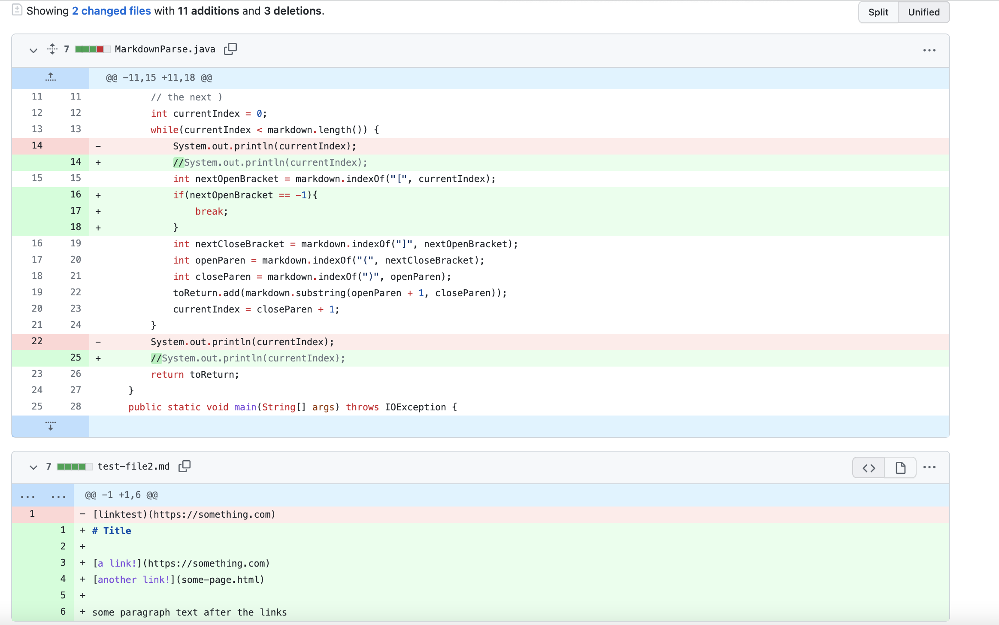
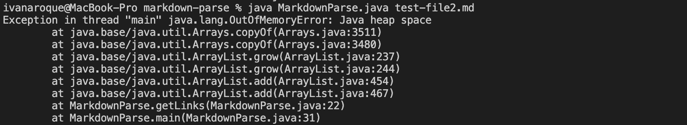
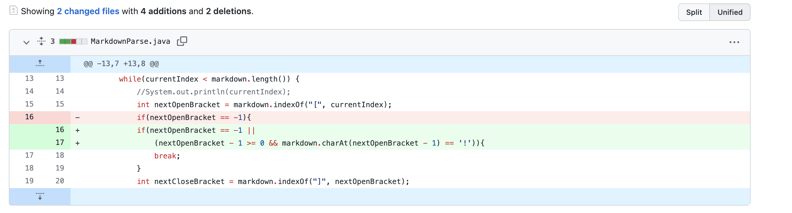
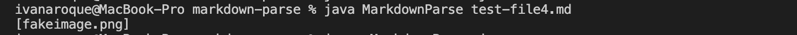
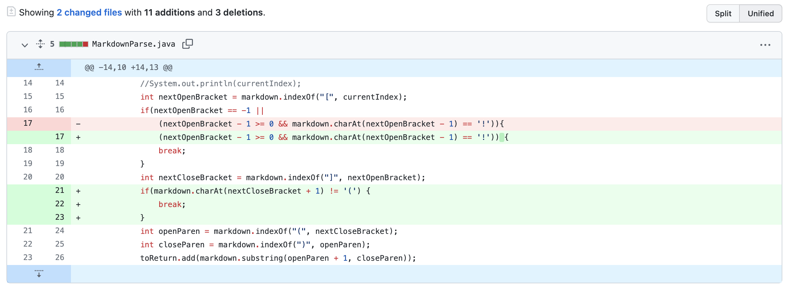
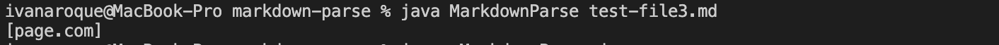

# Lab Report 2

## Fix #1

[1st failure-inducing input](https://github.com/iroque4/markdown-parse/blob/main/test-file2.md)

The failure-inducing file, test-file2.md did not contain an open parentheses after the second link. My code had a bug where conditional statement is continuously satisfied. As a symptom, our code enters an infinite loop.

## Fix #2

[2nd failure-inducing input](https://github.com/iroque4/markdown-parse/blob/main/test-file4.md)

The failure inducing file, test-file4.md, contained an image instead of a link. However, our code had a bug where it would interpret the image as a link, and a our symptom was an incorrect printed link.

## Fix #3

[3rd failure-inducing input](https://github.com/iroque4/markdown-parse/blob/main/test-file3.md)

The failure-inducing file, test-file3.md did not contain a link since the brackets were separated from the parentheses. However, my code had a bug where it would interpret it as a link. As a symptom, my code printed the wrong output.

