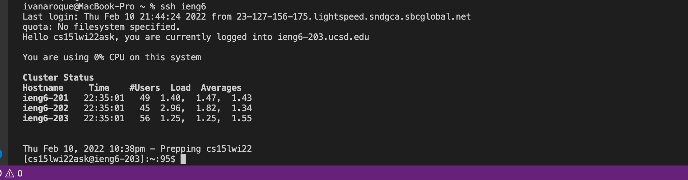
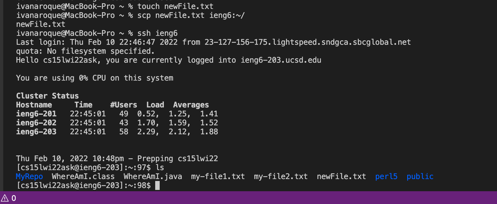

# Lab Report 3 (Streamlining ssh Configuration)

## Create a config file in the .ssh directory and edit the file
If it does not exist, create a config file in the .ssh directory on your computer.

This can be done by the following command:
`touch ~/.ssh/config`

Once this is done, open `~/.ssh/config` using `vim ~/.ssh/config` and add these lines on the file:
```
Host ieng6
    HostName ieng6.ucsd.edu
    User cs15lwi22zzz (use your username)
```
After creating and editing `~/.ssh/config` you should be able to ssh using the alias `ieng6`.

## ssh into your account using your chosen alias
Instead of trying to ssh into you account with the command `ssh cs15lwi22xx@ieng6.ucsd.edu`, you can ssh into your account using your chosen alias like ieng6.

To ssh into your account using the alias, you would run the command `ssh ieng6`.


## scp a file to your account using the alias
You can also use the alias when using the `scp` command to copy files.

