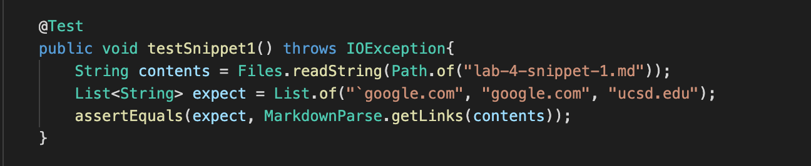
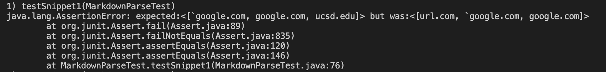
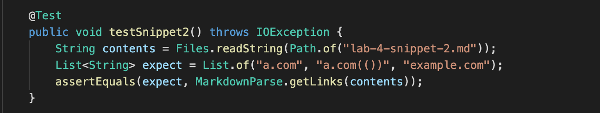
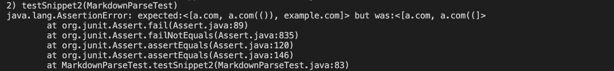
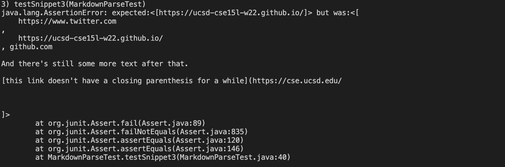
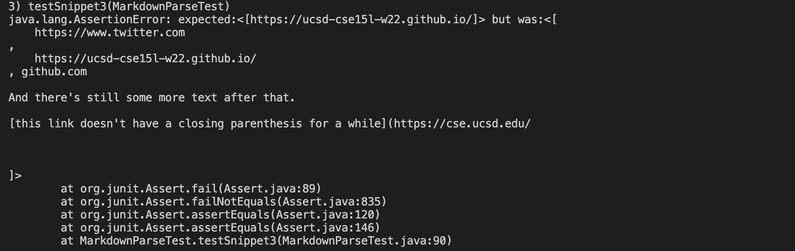

# Lab Report 4

my markdown repository: 
[my repo](https://github.com/iroque4/markdown-parse)

reviewed markdown repository:
[reviewed repo](https://github.com/JaredJose/markdown-parse)

## Snippet 1
From the VSCode preview, we expect our output to be [`google.com, a.com(()), ucsd.edu]

My repo test output:

Other repo test output:

## Snippet 2
From the VSCode preview, we expect our output to be [a.com, google.com, example.com]

My repo test output:

Other repo test output:

## Snippet 3
From the VSCode preview, we expect our output to be [https://ucsd-cse15l-w22.github.io/]

My repo test output:

Other repo test output:
