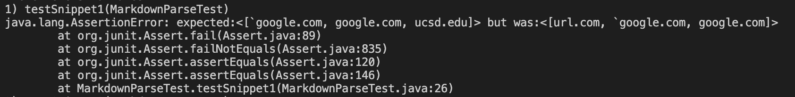
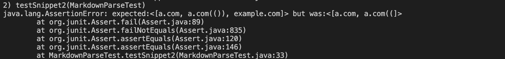
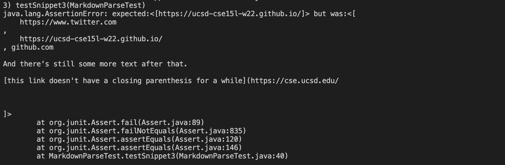

# Lab Report 4

my markdown repository: 
[my repo](https://github.com/iroque4/markdown-parse)

reviewed markdown repository:
[reviewed repo](https://github.com/JaredJose/markdown-parse)

## Snippet 1
From the VSCode preview, we expect our output to be [`google.com, a.com(()), ucsd.edu]

Test:

My repo test output:

Other repo test output:

Answer:
In order to change the code to work for all cases of markdown files with backticks, we would need more than 10 lines. Since we need to include multiple cases where the tick mark can disrupt a hyperlink and we might need to keep track of the indices of the backticks, 10 lines will not be enough.

## Snippet 2
From the VSCode preview, we expect our output to be [a.com, google.com, example.com]

Test:

My repo test output:

Other repo test output:

Answer:
In order to change the file we would need iterate between the nextOpenBracket and the nextCloseBracket, and make the nextOpenBracket be the index of the last open bracket we come across with while iterating. We would have to repeat this process for all four symbols. Because of this, I think that we will need more than 10 lines of code.

## Snippet 3
From the VSCode preview, we expect our output to be [https://ucsd-cse15l-w22.github.io/]

Test:

My repo test output:

Other repo test output:

Answer:
In order to make the code we need to reassign the nextOpenBracket to the next open bracket whenever there is an empty new line between two of the required symbols. Then we need continue to do this process over again. Since we only need to check an additional condition after each assignment of variables, it is possible to do it in less than 10 lines.