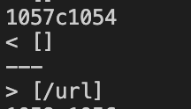
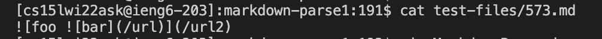
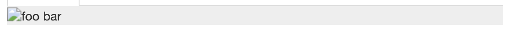
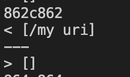
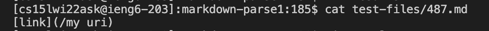
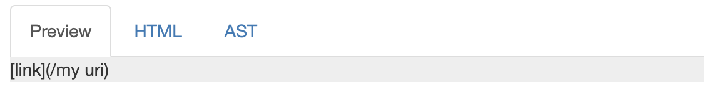

# Lab Report 5

I was able to find these tests using diff on the results.txt files which contained the output of running getLinks() with a directory for both repositories. Running diff printed out the differences between these two files and the line number of this difference. From that result, I was able to find the test that produced different outputs.

## First Test (file 573)

My output vs markdown-parse output:

file 573:

Expected output:

I believe that my output for this test is correct because this test would contain no links and would only contain a nested image. The issue is that in the markdown-parse implementation of MarkdownParse, it does not check if the '!' character is present before the open bracket causing it to interpret an image as a link. To fix the issue that is happening with the output, we can check the if the beginning of a close parenthesis is a '!' indicating it will not be interpreted as an link.

## Second Test (file 487)

My output vs markdown-parse output:

file 487:

Expected output:

I believe that the markdown-parse output is correct because this test would not contain a link because the url contained in the parenthesis possesses a space. The issue is that my code does not check whether the link which is what is written inside of the brakets do not contain any spaces. To fix the issue, we can add a condition that will check whether the url does not contain any spaces.